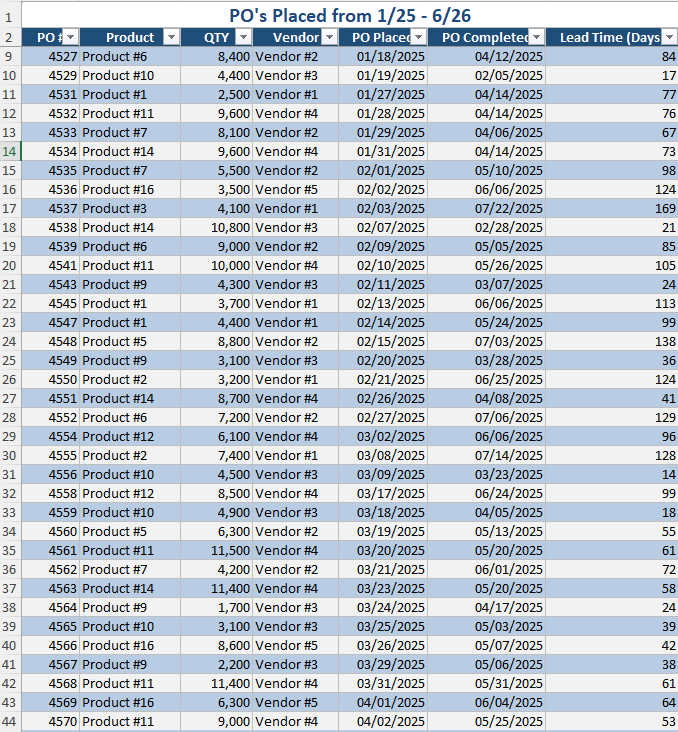
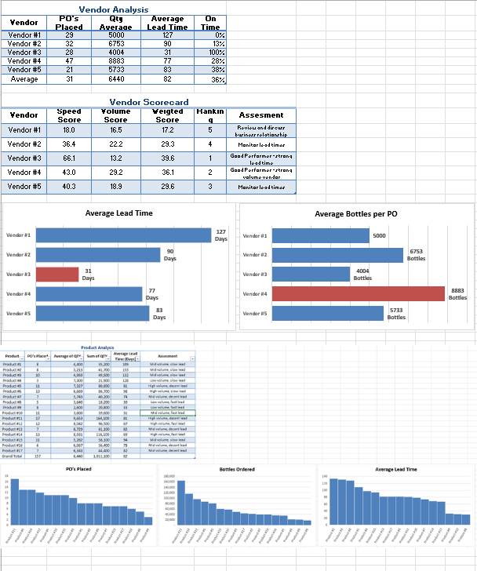
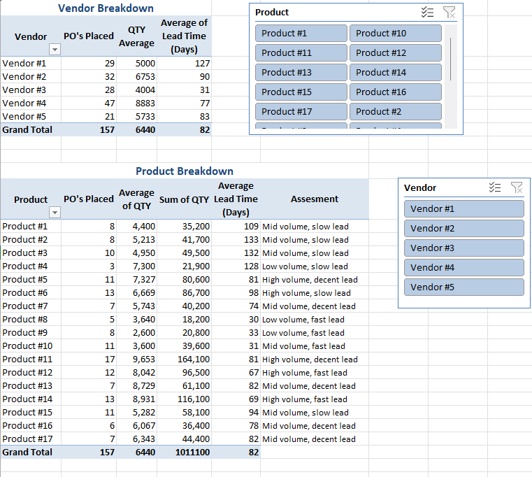

<h1> Purchasing Performance Dashboard </h1>

<h2>Description</h2>
The Purchasing Performance Dashboard is an Excel-based procurement tool designed to bring data-driven accountability to the purchase order process by analyzing vendor and product performance across a full year of order history. It consolidates 157 purchase orders spanning 17 products and 5 vendors into a single interface, tracking key operational metrics including order volume, lead time, and on-time delivery rate against a 60-day SLA benchmark. The dashboard uses PivotTables and dynamic median-based formulas to automatically classify each product by volume tier and lead-time performance, surfacing at a glance which SKUs are moving fast, which are consistently delayed, and which vendors are driving the delays. A vendor scorecard normalizes speed, consistency, and volume into comparable performance ratings, while product-level views reveal which vendor-product pairings deliver fastest, establishing baseline data to guide future PO placement and re-sourcing decisions. By transforming raw order data into tiered performance profiles, the tool reduces manual vendor comparison, strengthens supplier accountability, and enables faster, better-informed procurement decisions that minimize fulfillment delays.</a> </h1>
 

<h2>Languages and Utilities Used</h2>

- <b>Excel</b>
- <b>PivotTables</b>
- <b>Advanced Formulas</b>

  

  <h1>Project Process</h1>

<table width="100%" style="table-layout: fixed;">
  <tr>
    <td align="center" valign="top" width="33%">
      

        
        <b>Data Collection</b>
         
        <h6 style="text-align: center; min-height: 150px; font-size: 2px;">
          Purchase order data from January 2025 – June 2026 was extracted and consolidated into a single Excel spreadsheet
              Each record captures the product, order quantity, vendor, and the ordering and receiving dates for every PO. Product and Vendor names has been anonymized for confidentiality purposes.
        </h6>
      

    </td>
    <td align="center" valign="top" width="33%">
      

        
        <b>Vendor + Product Analysis</b>
        <h6 style="text-align: center; min-height: 150px;">
          The dashboard analyzes performance from two angles - Vendor and Product.
            Vendor: Tracks each vendor's order volume, lead time, and on-time delivery rate. These metrics were then standardized into a scoring model that computes comparable ratings across speed and volume. These scores were then used to assess the overall relationship with each vendor.
            Product: Tracks each product's order volume, lead time, and on-time delivery rate. These metrics were then standardized into an assessment model that classifies every product into volume and lead-time tiers using median-based thresholds, making it easy to identify which items move fast and which are consistently delayed.
        </h6>
      

    </td>
    <td align="center" valign="top" width="33%">
      

        
        <b>Vendor-Product Breakdown</b>
        <h6 style="text-align: center; min-height: 150px;">
          A dynamic PivotTable that cross-references the vendor and product analyses, letting users break down vendors by product or products by vendor. It reveals who manufactures what and how volume and lead time vary across each pairing, highlighting the strongest vendor-product relationships and re-sourcing opportunities.
        </h6>
      

    </td>
   
  </tr>
</table>
